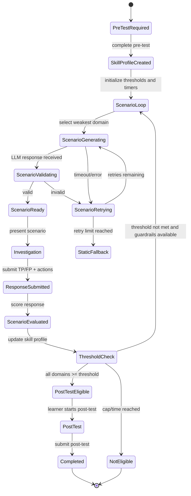

# Adaptive Loop State Machine

## Purpose

กำหนดวงจรการเรียนรู้แบบ Adaptive ของผู้เรียน ตั้งแต่จบ Pre-test จนถึงสิทธิ์เข้า Post-test โดยใช้ Proficiency Threshold, Maximum Scenario Cap และ Maximum Time เป็น Guardrail

สถานะ: **Draft — Decision Contract**

---

## 1. Configuration Defaults

```text
proficiency_threshold_default = 70
max_scenarios_default = 10
simulation_time_limit_default = 120 minutes
llm_max_retries_default = 2
```

ทุกค่าต้องเปลี่ยนได้ผ่าน Configuration และต้องบันทึกค่าที่ใช้จริงไว้ใน Research Session/Participant Run เพื่อให้ตรวจสอบย้อนหลังได้

---

## 2. State Diagram



---

## 3. State Contract

| State | Entry Condition | Required Data | Exit Condition |
|---|---|---|---|
| `pre_test_required` | ยังไม่มี Pre-test ที่เสร็จสมบูรณ์ | Participant ID | Pre-test complete |
| `skill_profile_created` | คำนวณคะแนนราย Domain แล้ว | Pre-test score, Blueprint version | Profile initialized |
| `scenario_loop` | ยังไม่ถึง Threshold | Threshold, cap, time budget | Start generation หรือ guardrail reached |
| `scenario_generating` | เริ่มสร้าง Scenario | Skill gap, blueprint, model config | LLM result/error |
| `scenario_validating` | ได้ Scenario Candidate | Candidate JSON, schema version | Valid/Invalid |
| `scenario_retrying` | Generation/Validation ไม่ผ่าน | Retry count, reason | Retry หรือ Fallback |
| `static_fallback` | Retry ครบหรือ LLM unavailable | Fallback reason | Static Scenario validated |
| `investigation` | Scenario แสดงแล้ว | Snapshot, logs, started_at | Submit response |
| `response_submitted` | ผู้เรียนส่งคำตอบ | TP/FP, findings, actions | Score calculated |
| `scenario_evaluated` | คำนวณคะแนนแล้ว | Component scores | Update profile |
| `threshold_check` | Profile ถูกอัปเดต | Domain scores, cap/time | Eligible, loop, or not eligible |
| `post_test_eligible` | ทุก Domain ถึง Threshold | Completion status | Learner starts Post-test |
| `not_eligible` | Cap หรือ Time Limit ถึงก่อน | Failure reason, domain breakdown | End run |
| `completed` | Post-test ส่งเสร็จ | Pre/Post/Simulation data | End run |

---

## 4. Stopping Rules

ระบบต้องหยุด Scenario Loop เมื่อเกิดเงื่อนไขใดเงื่อนไขหนึ่ง:

1. ทุก Domain มีคะแนน `>= proficiency_threshold`
2. จำนวน Scenario ถึง `max_scenarios`
3. เวลารวมถึง `simulation_time_limit`
4. ผู้เรียนเลือกออกจากระบบหรือ Session ถูก Abandon
5. ระบบไม่สามารถสร้าง/โหลด Scenario ที่ Valid ได้หลัง Retry และ Fallback

### Post-test Eligibility

ตาม Decision Q21:

- ถึง Threshold ครบทุก Domain → `eligible_for_post_test`
- ไม่ถึง Threshold ภายใน Guardrail → `not_eligible_for_post_test`
- ไม่ควร Redirect เข้า Post-test อัตโนมัติ
- แสดง Domain Breakdown และเหตุผลให้ผู้เรียนเห็น

---

## 5. Adaptive Selection Rule

การเลือก Scenario ถัดไปต้องใช้:

```text
weakest_domain = domain with lowest proficiency score
candidate_pool = scenarios compatible with weakest_domain
next_scenario = candidate matching difficulty and unmet skill gap
```

ต้องบันทึกเหตุผลการเลือก เช่น:

```json
{
  "selected_domain": "domain2",
  "selection_reason": "lowest_proficiency",
  "current_score": 42.5,
  "threshold": 70,
  "scenario_difficulty": 3,
  "selection_policy_version": "adaptive-v1"
}
```

ห้ามพึ่งการสุ่มเพียงอย่างเดียวจนไม่สามารถอธิบายได้ว่าเหตุใดผู้เรียนจึงได้รับ Scenario นั้น

---

## 6. Required Run Metadata

- `research_run_id`
- `participant_id`
- `threshold_value`
- `max_scenarios`
- `time_limit_seconds`
- `scenario_count`
- `elapsed_seconds`
- `current_state`
- `completion_reason`
- `domains_reached_threshold`
- `domains_not_reached_threshold`
- `selection_policy_version`
- `blueprint_version`
- `rubric_version`

---

## 7. Invariants

- ห้ามเข้า Post-test ถ้า Domain ใด Domain หนึ่งต่ำกว่า Threshold
- ห้ามนับ Scenario ที่สร้างไม่สำเร็จเป็น Scenario ที่ผู้เรียนทำเสร็จ
- Snapshot ต้องถูกสร้างก่อนรับคำตอบผู้เรียน
- คะแนนดิบต้องไม่ถูกเขียนทับหลังการวิเคราะห์
- Session ที่จบแบบ Not Eligible ต้องยังคงอยู่ใน Dataset
- การ Retry ต้องมีเพดาน
- เมื่อหมดเวลา ต้องบันทึกเวลาจริงและ Reason Code

---

## 8. Test Scenarios

- Pre-test complete → all domains below threshold → Scenario Loop starts
- Scenario raises one domain above threshold but others remain below → loop continues
- All domains reach 70% → Post-test eligible
- Ten scenarios completed without threshold → not eligible
- 120 minutes elapsed → not eligible
- LLM fails twice → Static Fallback
- Invalid LLM schema → retry then fallback
- Refresh during investigation → restore same Snapshot and Session
- Abandonment → preserve partial run and reason

---

## 9. Open Implementation Questions

- วิธีคำนวณ Weighted Average ของ Proficiency Score
- การจัดการกรณีไม่มี Candidate Scenario ใน Weakest Domain
- การนับเวลาขณะ Browser ปิดหรือ Network หลุด
- วิธี Resume หลัง Session ถูก Abandon
- การกำหนดสถานะถาวรใน Database ให้สอดคล้องกับ API ปัจจุบัน

---

**เอกสารนี้กำหนดพฤติกรรมของ Adaptive Loop ไม่ใช่ Implementation รายไฟล์**
