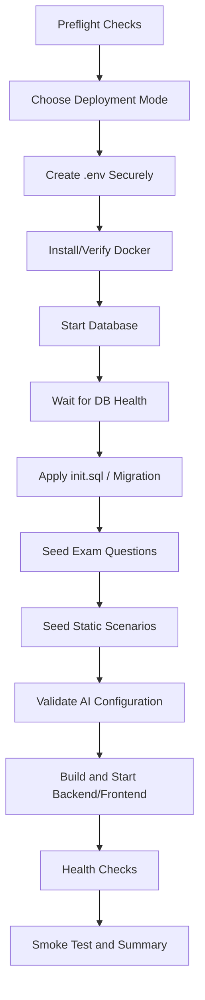

# Deployment Bootstrap Plan

## Purpose

กำหนดแนวทางสำหรับ `install.sh` ที่ช่วยติดตั้งระบบ Automated Data-Driven Cyberattack Simulation for Blue Team Training ตั้งแต่เครื่องเปล่าจนถึงระบบพร้อมใช้งาน โดยเน้น:

- ติดตั้งซ้ำได้
- ใช้กับ Ubuntu VM บน Cloud เป็น Reference Deployment
- สร้าง `.env` อย่างปลอดภัย
- ติดตั้งและตรวจสอบ PostgreSQL
- โหลด Schema และ Static Data
- ตรวจสอบ/บันทึก AI API Configuration
- เปิดบริการผ่าน Docker Compose
- มี Health Check และ Verification
- ไม่เปิดเผย Secret ใน Terminal Output หรือ Git

> เอกสารนี้เป็น Design Plan สำหรับส่งต่อให้ Antigravity ไม่ใช่คำสั่งให้แก้โค้ดทันที

---

## 1. Supported Deployment Contract

### ระยะที่ 1: Reference Target

- Ubuntu LTS บน Cloud VM
- Docker Engine และ Docker Compose Plugin
- Git
- สิทธิ์ `sudo`
- Domain หรือ Public IP ที่ผู้ดูแลจัดการเอง
- Firewall เปิดเฉพาะ Port ที่จำเป็น

### Local Development

ควรใช้คำสั่งเดียวกันให้มากที่สุด แต่แยกความแตกต่างไว้ที่ `.env` และ Compose Profile

### ไม่ควรสัญญาในระยะเริ่มต้น

- รองรับ Cloud Provider ทุกเจ้าโดยใช้ Script เดียว
- Provision VM อัตโนมัติจาก AWS/GCP/Azure
- ตั้งค่า DNS, TLS และ Managed Database ครบทุกเจ้า
- ใช้ API Key แบบฝังใน Image หรือ Source Code

---

## 2. Installation Lifecycle



`install.sh` ต้องหยุดทันทีเมื่อขั้นตอนสำคัญล้มเหลว และต้องบอกวิธีแก้ที่ตรวจสอบได้ ไม่ควรดำเนินการต่อด้วยสถานะครึ่งติดตั้ง

---

## 3. Proposed CLI Modes

```text
./install.sh install
./install.sh install --mode local
./install.sh install --mode cloud
./install.sh check
./install.sh seed
./install.sh update
./install.sh backup
./install.sh uninstall
```

### `install`

ติดตั้งหรือเตรียมระบบทั้งหมดตั้งแต่ Preflight ถึง Verification

### `check`

ตรวจ Docker, Compose, Port, Disk, Environment และ Service Health โดยไม่แก้ไขระบบ

### `seed`

โหลด/อัปเดต Static Questions และ Static Scenarios แบบ Idempotent โดยไม่ลบข้อมูลผู้เรียน

### `update`

Pull/Build Image หรือ Source ตาม Deployment Contract แล้วทำ Migration/Health Check

### `backup`

Export PostgreSQL Database ก่อน Update หรือก่อนทำลาย Environment

### `uninstall`

หยุดและลบ Runtime ตามระดับที่ผู้ใช้เลือก ต้องยืนยันก่อนลบ Persistent Volume หรือข้อมูลการวิจัย

---

## 4. `.env` and Secret Handling

### Interactive Setup

หากไม่พบ `.env` ให้ Script:

1. Copy `.env.example` เป็น `.env`
2. สุ่มค่า `JWT_SECRET` ด้วย Cryptographically Secure Random Generator
3. ให้ผู้ดูแลกรอกค่าฐานข้อมูลที่จำเป็น
4. ให้เลือก LLM Provider แบบ OpenAI-compatible
5. รับ `LLM_API_KEY` ผ่าน Hidden Input หรือให้กำหนดจาก Environment/Secret Manager
6. ตรวจว่า Key ไม่ว่างเมื่อเลือก Real-time LLM Mode
7. ตั้ง Permission ของ `.env` ให้เจ้าของไฟล์อ่าน/เขียนได้เท่านั้นบน Linux (`chmod 600`)

### ข้อห้าม

- ห้ามแสดง API Key ใน Summary
- ห้าม `set -x` ขณะอ่านหรือใช้ Secret
- ห้ามเขียน Key ลง Log
- ห้าม Commit `.env`
- ห้ามส่ง Key ไป Frontend
- ห้ามฝัง Key ใน Docker Image
- ห้ามใช้ Default Password ใน Cloud Mode

### Non-interactive Mode

สำหรับ CI/CD หรือ Automation ต้องรองรับการส่งค่าผ่าน Environment หรือ Secret File โดยไม่บังคับให้ใส่ Key ผ่าน Command-Line Argument เพราะ Argument อาจปรากฏใน Process List หรือ Shell History

ตัวอย่างแนวคิด:

```text
LLM_API_KEY_FILE=/secure/path/llm_api_key
POSTGRES_PASSWORD_FILE=/secure/path/postgres_password
./install.sh install --non-interactive
```

---

## 5. Database Bootstrap

ลำดับที่ต้องรักษา:

1. Start PostgreSQL/pgvector
2. รอ Health Check จนพร้อมรับ Connection
3. Apply `init.sql` หรือ Migration ที่เป็น Source of Truth
4. ตรวจว่าตารางและ Extension ที่จำเป็นมีอยู่
5. Parse/Load CompTIA Security+ Questions
6. Load Static Scenarios
7. Validate จำนวนข้อมูลและความถูกต้องของ Foreign Keys
8. ห้ามลบ `users`, `exam_sessions`, `simulation_sessions` และ Research Data ระหว่าง Update ปกติ

### Idempotency

Seed Script ต้องรันซ้ำได้โดยไม่สร้างข้อมูลซ้ำ และต้องมีนโยบายชัดเจนสำหรับ:

- Question Identity
- Scenario Identity
- Version ของ Static Content
- การเปลี่ยนแปลง Scenario เดิม
- การรักษา Historical Snapshot ของ Scenario ที่ผู้เรียนเคยทำ

> Script ปัจจุบัน `load_scenarios_to_db.py` ลบ Simulation Sessions และ Scenarios ก่อน Seed ใหม่ จึงไม่ควรถูกเรียกเป็น Default ใน Production/Research Environment โดยไม่เพิ่ม Safe Mode หรือ Explicit Destructive Flag

---

## 6. Service Startup Order

```text
Database
→ Backend Dependency Check
→ Backend
→ Frontend
→ End-to-End Health Check
```

`depends_on` เพียงอย่างเดียวไม่ควรถูกถือว่า Database พร้อมใช้งาน ต้องมี Health Check และ Retry/Wait Policy

### Health Checks ที่ควรมี

- PostgreSQL readiness
- Backend `/health` หรือ endpoint เทียบเท่า
- Frontend HTTP response
- Database migration status
- Seed validation status
- LLM Configuration status โดยไม่ทดสอบเรียก API แบบเสียค่าใช้จ่ายโดยอัตโนมัติ

---

## 7. Cloud Safety Baseline

ก่อนเปิดระบบบน Cloud ต้องตรวจ:

- Firewall อนุญาตเฉพาะ 80/443 และ SSH จาก Source ที่จำเป็น
- PostgreSQL ไม่เปิด Public Internet
- pgAdmin ไม่เปิด Public ถ้าไม่จำเป็น
- เปลี่ยน Default Credentials ทุกตัว
- ใช้ HTTPS ก่อนรับข้อมูลผู้เรียนจริง
- มี Backup และ Restore Procedure
- มี Log Rotation
- มี Disk Alert
- มี Resource Limits
- ปิด Debug Mode
- ไม่ใช้ `latest` แบบไร้การ Pin ใน Deployment ที่ต้องทำซ้ำ

---

## 8. Verification Checklist

หลังติดตั้งต้องตรวจและแสดงเฉพาะข้อมูลที่ไม่เป็นความลับ:

- [ ] Docker Engine ใช้งานได้
- [ ] Compose Config ผ่านการ Parse
- [ ] Database Health ผ่าน
- [ ] Schema/Extensions ผ่าน
- [ ] Security+ Questions ถูกโหลด
- [ ] Static Scenarios ถูกโหลด
- [ ] Backend Health ผ่าน
- [ ] Frontend Response ผ่าน
- [ ] Register/Login Smoke Test ผ่าน หรือถูกระบุว่า Manual
- [ ] Pre-test Initialization คืนคำถาม 30 ข้อ
- [ ] Scenario Start ทำงาน
- [ ] LLM Mode หรือ Static Fallback แสดงสถานะถูกต้อง
- [ ] `.env` ไม่ถูก Commit
- [ ] ไม่มี Secret ใน Installer Output

---

## 9. Failure and Recovery

ทุกขั้นตอนต้องมีข้อความ Error ที่บอก:

- ขั้นตอนไหนล้มเหลว
- ตรวจสอบอะไรต่อ
- คำสั่ง Check ที่ปลอดภัย
- สามารถ Resume ได้หรือไม่
- ต้อง Rollback หรือ Backup ก่อนหรือไม่

ห้ามทำสิ่งต่อไปนี้โดยอัตโนมัติ:

- ลบ Database Volume เพื่อแก้ปัญหา
- ลบข้อมูลผู้เรียน
- ลบ Research Dataset
- เปิด Port กว้างเพื่อแก้ Connection
- ปิด TLS หรือ Auth เพื่อให้ติดตั้งผ่าน
- Retry LLM API แบบไม่จำกัดจนเกิดค่าใช้จ่าย

---

## 10. Definition of Done

- [ ] ติดตั้ง Local ได้จาก Clean Environment
- [ ] ติดตั้งบน Ubuntu Cloud VM ได้ตาม Reference Contract
- [ ] สร้าง `.env` ได้โดยไม่แสดง Secret
- [ ] สร้าง JWT Secret ใหม่ได้
- [ ] Database พร้อมก่อน Seed
- [ ] โหลด Questions และ Static Scenarios ได้
- [ ] Seed ซ้ำได้โดยไม่ทำลายข้อมูลผู้เรียน
- [ ] API Key ถูกส่งให้ Backend เท่านั้น
- [ ] มี Health Check และ Smoke Test
- [ ] มี Backup/Restore Procedure
- [ ] มี Uninstall ที่ป้องกันการลบข้อมูลโดยไม่ตั้งใจ
- [ ] มีเอกสาร Cloud Firewall และ HTTPS

---

## Safety Note for Research Data

เพราะ Q21 กำหนดว่าเฉพาะผู้เรียนที่ถึง Threshold เท่านั้นจึงเข้า Post-test ได้ ระบบต้องแยกสถานะอย่างน้อย:

- `eligible_for_post_test`
- `threshold_not_reached`
- `max_scenarios_reached`
- `time_limit_reached`
- `abandoned`
- `completed`

Installer และ Seed/Update Flow ห้ามลบข้อมูล Session เหล่านี้ เพราะข้อมูลผู้เรียนที่ไม่จบมีความสำคัญต่อการวิเคราะห์ Attrition และ Selection Bias

---

## Open Decisions

- จะใช้ Docker Compose เป็น Cloud Runtime หลักหรือเตรียม Kubernetes Deployment ตั้งแต่ต้น?
- จะใช้ Managed PostgreSQL หรือ Database Container บน VM ใน Reference Deployment?
- จะจัดการ Secret ด้วย `.env`, Docker Secrets หรือ Cloud Secret Manager?
- จะให้ `install.sh` Build จาก Source หรือ Pull Versioned Images?
- จะให้ LLM API Key เป็น Required ใน Production หรืออนุญาต Static Fallback เสมอ?

