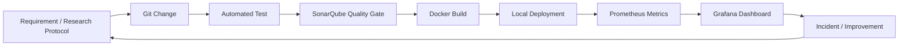

# DevOps Extension Roadmap

## Purpose

วางแผนการนำ DevOps Tools มาเสริม Senior Project โดยไม่ทำให้ Core Learning Platform และงานวิจัยเสียสมดุล

> ผู้พัฒนาโค้ดหลัก: Antigravity
>
> หลักการ: Core Product มาก่อน, DevOps เป็น Extension ที่เพิ่มความสามารถในการส่งมอบและดูแลระบบ

---

## 1. Boundary

### Senior Project Core

- Pre-test / Post-test
- User Skill Profile
- Real-time Scenario Generation
- Static Fallback
- Logs and Evidence Investigation
- TP/FP Classification
- Response Actions
- Scoring
- Adaptive Scenario Loop
- Multi-user Research Evaluation

### DevOps Extension

- Reproducible local environment
- Automated build and test
- Quality gate
- Container deployment
- Infrastructure as Code
- Configuration Management
- Kubernetes Operations
- Metrics and Dashboard
- Cloud Architecture Mapping

---

## 2. Workflow แบบงานจริง



---

## 3. Phases

### Phase A — Baseline และ Reproducibility

**เป้าหมาย:** คนอื่นสามารถรันระบบตาม README ได้

- ตรวจสอบ Backend, Frontend, Database และ Seed Flow
- ตรวจสอบ `.env.example` และกำจัด Default Secret ที่ไม่ปลอดภัย
- กำหนดคำสั่งติดตั้งและทดสอบที่แน่นอน
- ตรวจสอบ Docker Compose ปัจจุบัน
- ระบุ Health Check ของแต่ละ Service
- บันทึก Resource Requirement ของเครื่อง

**Gate:** Clean start และ Core Integration Flow ทำงานได้

### Phase B — Git Workflow

- กำหนด Branch Naming
- กำหนด Commit Convention
- ทำ Pull Request Checklist
- แยก Feature, Bugfix, Docs และ Research Data Changes
- ห้าม Commit Secrets หรือข้อมูลผู้เข้าร่วมจริง

**Gate:** ทุกการเปลี่ยนแปลงย้อนกลับและตรวจสอบได้

### Phase C — Docker

- ทำ Backend และ Frontend ให้ Build ซ้ำได้
- Pin Base Image และ Dependency เท่าที่เหมาะสม
- ใช้ Multi-stage Build
- รัน Process ด้วย User ที่เหมาะสม
- เพิ่ม Healthcheck
- แยก Development และ Production Configuration

**Gate:** Build และ Start จากเครื่องใหม่ได้โดยไม่พึ่งไฟล์ลับบนเครื่องผู้พัฒนา

### Phase D — Jenkins CI

Pipeline ที่แนะนำ:

```text
Checkout
→ Backend Build
→ Frontend Build
→ Unit Tests
→ Integration Tests
→ Scenario Schema Validation
→ Docker Build
→ Archive Test Reports
```

กติกา:

- Pipeline ต้อง Fail เมื่อ Test ไม่ผ่าน
- Pipeline ต้อง Fail เมื่อ Scenario Schema ไม่ถูกต้อง
- ต้องเก็บ Log และ Test Artifact
- ช่วงแรกไม่ต้อง Deploy อัตโนมัติไป Public Cloud

**Gate:** Commit ที่มี Bug สำคัญไม่สามารถผ่าน Pipeline ได้

### Phase E — SonarQube

- วิเคราะห์ Go และ TypeScript
- ตั้ง Quality Gate ขั้นต่ำ
- แยก New Code Issues ออกจาก Legacy Issues
- บันทึก False Positive และเหตุผลการยกเว้น
- อย่าให้ Quality Gate กลายเป็นตัวขัดขวางการทำวิจัยโดยไม่มีเหตุผล

**Gate:** Quality Policy ถูกอธิบายและตรวจสอบได้

### Phase F — Local Kubernetes

- ใช้ Kind หรือ Kubernetes ที่เหมาะกับเครื่อง
- สร้าง Namespace แยก Project
- Deploy Frontend, Backend และ Database ตามความเหมาะสม
- เพิ่ม Liveness/Readiness Probes
- กำหนด Resource Requests/Limits
- ทดสอบ Rolling Update และ Rollback

ข้อควรระวัง:

- PostgreSQL ใน Kubernetes เป็นเรื่อง State Management ต้อง document ให้ชัด
- หากการใช้ Database บน Kubernetes เพิ่มความเสี่ยงเกินประโยชน์ ให้คง Database ไว้ใน Compose และใช้ Kubernetes กับ Stateless Services ก่อน

**Gate:** Core User Journey ทำงานหลัง Pod Restart และ Rollback

### Phase G — Terraform + Ansible

#### Terraform

ใช้กำหนด:

- Local Docker Network
- Local Containers หรือ Kubernetes Resources
- Variables และ Outputs
- Plan/Apply/Destroy

#### Ansible

ใช้กำหนด:

- Configuration ของ Local Lab
- Setup Scripts
- Idempotent Service Configuration

**Gate:** Environment Setup ทำซ้ำได้ และมีคำสั่ง Destroy/Cleanup

### Phase H — Prometheus + Grafana

Metrics ที่มีประโยชน์:

- API Request Count
- API Error Count
- Request Latency
- Scenario Generation Success/Failure
- LLM Fallback Count
- Simulation Completion Count
- Pre-test/Post-test Completion Count
- Database Health

Dashboard ควรตอบคำถามจริง เช่น:

- ผู้เรียนเริ่ม Scenario แล้วจบกี่เปอร์เซ็นต์?
- LLM ล้มเหลวและใช้ Fallback บ่อยแค่ไหน?
- API ใดมี Error สูง?
- Scenario Generation ใช้เวลานานเท่าไร?

**Gate:** สามารถตรวจสอบ Health และพฤติกรรมของระบบจาก Dashboard ได้

### Phase I — AWS Architecture Mapping

- วาด Mapping จาก Local Components ไป AWS Services
- เปรียบเทียบ ECS/EKS, RDS, CloudWatch, IAM และ VPC
- ทำ Terraform Plan เฉพาะแบบไม่ Apply หากยังไม่มีงบ/มาตรการป้องกัน
- ไม่ผูกบัตรและไม่สร้าง Resource ที่อาจมีค่าใช้จ่ายโดยไม่ได้รับอนุมัติแยก

**Gate:** อธิบาย Migration Trade-off ได้โดยไม่ต้องมี AWS Resource จริง

---

## 4. ลำดับความสำคัญ

| ลำดับ | Extension | เหตุผล |
|---:|---|---|
| 1 | Docker Reproducibility | เป็นฐานของทุกขั้นต่อไป |
| 2 | Jenkins CI | ทำให้การเปลี่ยนแปลงตรวจสอบอัตโนมัติ |
| 3 | SonarQube | เพิ่ม Quality Gate |
| 4 | Local Kubernetes | ฝึก Deployment และ Recovery |
| 5 | Prometheus/Grafana | ฝึก Observability |
| 6 | Terraform/Ansible | ฝึก IaC และ Configuration Management |
| 7 | AWS Mapping | ฝึก Cloud Design โดยไม่เสี่ยงค่าใช้จ่าย |

---

## 5. Resource Strategy สำหรับเครื่อง Local

เนื่องจากเครื่องพัฒนามี RAM 16 GB และพื้นที่ C: เหลือประมาณ 56 GB:

- ไม่ควรรัน Jenkins, SonarQube, Kubernetes, Prometheus และ Grafana พร้อมกันตลอดเวลา
- ใช้ Compose Profiles หรือเปิดทีละ Stage
- ลบ Image/Container/Volume ที่ไม่ใช้แล้ว
- เก็บ Database Volume อย่างระมัดระวัง
- บันทึกคำสั่ง Cleanup ที่ปลอดภัย
- ตรวจสอบพื้นที่ก่อนเพิ่ม Stack ใหม่

---

## 6. Definition of Done ของ DevOps Extension

- [ ] มี README สำหรับ Clean Setup
- [ ] Docker Compose ทำงานได้
- [ ] มี Automated Tests ใน Jenkins
- [ ] มี Test Reports
- [ ] มี Quality Gate
- [ ] มี Container Image ที่ Build ซ้ำได้
- [ ] มี Local Kubernetes Deployment หรือมีเหตุผลที่ยังไม่ทำ
- [ ] มี Rollback Evidence
- [ ] มี Metrics และ Dashboard ที่ตอบคำถาม Operational จริง
- [ ] มี Cleanup/Destroy Procedure
- [ ] มี AWS Mapping โดยไม่ใช้เงินจริง

---

## 7. ข้อห้ามด้านขอบเขต

- ห้ามเริ่มจากติดตั้งเครื่องมือทั้งหมดพร้อมกัน
- ห้ามให้ DevOps Extension ทำให้ Core Evaluation ล่าช้า
- ห้ามเพิ่ม AWS Billing Risk เพื่อให้ได้คำว่า Cloud ใน Portfolio
- ห้ามเรียกว่าระบบ Production-ready หากยังไม่มี Security, Backup และ Recovery Evidence เพียงพอ

