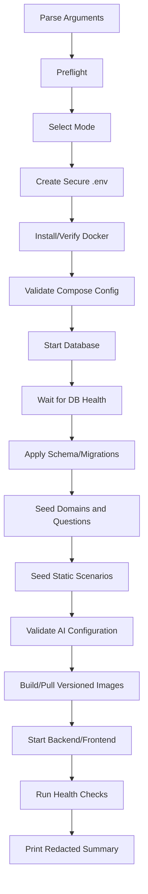

# install.sh Specification

## Purpose

กำหนดพฤติกรรมของ `install.sh` สำหรับติดตั้งระบบบน Local และ Ubuntu Cloud VM ตั้งแต่ Preflight จนถึง Application Stack พร้อมใช้งาน

สถานะ: **Draft — Implementation Specification สำหรับ Antigravity**

---

## 1. Scope

### Phase 1 Supported Target

- Ubuntu LTS VM ที่มี Internet และ `sudo`
- Docker Engine
- Docker Compose Plugin
- PostgreSQL Container ตาม Reference Deployment
- Backend และ Frontend ของระบบ

### Phase 2 Extension

- Reverse Proxy
- HTTPS
- Firewall Hardening
- Backup Schedule
- Log Rotation
- External/Managed PostgreSQL

`install.sh` ไม่ต้อง Provision VM ของทุก Cloud Provider ใน Phase 1

---

## 2. Commands

```bash
./install.sh install
./install.sh install --mode local
./install.sh install --mode cloud
./install.sh check
./install.sh seed
./install.sh check-seed
./install.sh update
./install.sh backup
./install.sh uninstall
./install.sh reset-dev-data
```

### Safety Classification

| Command | Default | Destructive |
|---|---|---:|
| `install` | Safe/idempotent | No |
| `check` | Read-only | No |
| `seed` | Safe/idempotent | No |
| `check-seed` | Read-only | No |
| `update` | Backup-aware | No |
| `backup` | Creates backup | No |
| `uninstall` | Requires explicit scope | Maybe |
| `reset-dev-data` | Local-only | Yes |

---

## 3. Installation Pipeline



หากขั้นตอนสำคัญล้มเหลวต้องหยุดทันที พร้อมแสดง Failure Stage และคำสั่งตรวจสอบที่ปลอดภัย

---

## 4. Preflight Checks

ตรวจอย่างน้อย:

- Operating System และ Architecture
- User มี `sudo` เมื่อ Cloud Mode
- Disk Space เพียงพอ
- RAM ขั้นต่ำตาม Stack ที่เลือก
- Docker Engine/Compose Version
- Required Ports
- DNS/Network Reachability ตามที่จำเป็น
- Git เมื่อ Build from Source
- Source Files และ Required Scripts
- `.env`/Secret File ไม่ใช่ Directory และ Permission เหมาะสม

ห้ามแก้ Firewall หรือเปิด Port กว้างโดยอัตโนมัติเพื่อให้ Preflight ผ่าน

---

## 5. Environment Setup

หากไม่มี `.env`:

1. Copy `.env.example`
2. Generate `JWT_SECRET`
3. สร้าง Database Password ที่ไม่ใช่ Default ใน Cloud Mode
4. เลือก `LLM_MODE=llm` หรือ `LLM_MODE=static`
5. รับ API Key ผ่าน Hidden Prompt หรือ Secret File/Environment Variable
6. ตรวจ Required Variables
7. เขียนไฟล์ด้วย Permission `600` บน Linux

### Required Variable Groups

```text
POSTGRES_USER
POSTGRES_PASSWORD
POSTGRES_DB
JWT_SECRET
GIN_MODE
LLM_MODE
LLM_BASE_URL
LLM_MODEL
LLM_API_KEY (เมื่อ LLM_MODE=llm)
DEPLOYMENT_MODE
IMAGE_TAG หรือ BUILD_FROM_SOURCE
```

ห้ามรับ Secret ผ่าน CLI Argument และห้ามแสดงค่า Secret ใน Summary

---

## 6. Database Bootstrap

ลำดับที่บังคับ:

```text
Start DB
→ Wait for Health
→ Apply Schema/Migration
→ Seed Domains
→ Seed Questions
→ Seed Static Scenarios
→ Validate
```

ตรวจสอบ:

- Database Connection
- Required Extensions
- Required Tables/Enums
- Question Count/Blueprint
- Scenario Schema
- Foreign Key Integrity
- Seed Idempotency

Installer ต้องไม่เรียก Seed Script ที่ลบ Runtime/Research Data เป็น Default

---

## 7. LLM Configuration

### Static Mode

- ไม่ต้องมี API Key
- Scenario Generation ใช้ Static Fallback
- Health Check ต้องยืนยันว่า Static Pool พร้อม

### LLM Mode

- ต้องมี Base URL และ Model
- ต้องมี API Key จาก Secure Input/Secret
- ตรวจ Format ที่จำเป็นโดยไม่ Log Key
- Retry สูงสุด Default 2 ครั้งใน Runtime
- หาก Generate/Validate ไม่ผ่าน ให้ Static Fallback
- Installer ไม่ควรเรียก LLM API จริงโดยอัตโนมัติ

### Multi-provider Metadata

เมื่อสร้าง Scenario ต้องบันทึก:

```text
provider
model
prompt_version
blueprint_version
validation_status
fallback_reason
```

ไม่บันทึก API Key

---

## 8. Build and Image Strategy

รองรับ 2 โหมด:

### Build from Source

เหมาะสำหรับ Local/Academic Development:

```text
git/source check
→ backend build
→ frontend build
→ image build
→ compose up
```

### Pull Versioned Images

เหมาะสำหรับ Reference Cloud Deployment:

```text
validate IMAGE_TAG
→ pull exact tag
→ compose up
```

ห้ามใช้ `latest` เป็น Default ใน Cloud

---

## 9. Health and Smoke Checks

หลัง Start ต้องตรวจ:

- Container Status
- Database Health
- Backend Health
- Frontend HTTP Response
- Database Schema Version
- Seed Validation
- Authentication Flow แบบ Smoke Test ที่ไม่สร้างข้อมูลวิจัยปลอมถ้าไม่จำเป็น
- Pre-test Initialization ได้ 30 ข้อตาม Blueprint
- Static Scenario Start ได้
- LLM Mode แสดงสถานะโดยไม่เปิดเผย Secret

ผลลัพธ์ต้องเป็น Redacted Summary เช่น:

```text
Database: READY
Questions: VALID (30+ candidate pool)
Static Scenarios: READY
LLM Mode: CONFIGURED (key redacted)
Backend: HEALTHY
Frontend: HEALTHY
```

---

## 10. Update, Backup and Uninstall

### Update

```text
check
→ backup recommendation/backup
→ pull/build
→ migration
→ safe seed
→ health checks
```

### Backup

- Export Database อย่างน้อยก่อน Migration สำคัญ
- ไม่แสดง Password ใน Output
- บันทึก Backup Timestamp, Version และ Location
- Restore ต้องทดสอบแยกจาก Production Data

### Uninstall

ต้องให้ผู้ใช้เลือกระดับ:

- Stop services only
- Remove containers/images
- Remove volumes/data — ต้อง Confirmation เพิ่ม

Cloud/Research Mode ต้องปฏิเสธการลบข้อมูลโดยไม่มี Explicit Confirmation

---

## 11. Failure Handling

ทุก Error ต้องมี:

- Stage
- Exit Code
- Cause ที่เป็นไปได้
- Safe Diagnostic Command
- Resume/Retry Guidance

ห้าม:

- ลบ Volume อัตโนมัติ
- Retry LLM ไม่จำกัด
- เปิด Database สู่ Public Internet
- ปิด Authentication/TLS เพื่อแก้ปัญหา
- พิมพ์ Secret ลง Log

---

## 12. Acceptance Tests

- Clean Ubuntu VM → Install สำเร็จ
- Local Mode → Install สำเร็จ
- รัน Install ซ้ำ → ไม่ Duplicate และไม่ลบ User/Session
- ไม่มี API Key + Static Mode → ระบบพร้อมใช้งาน
- LLM Mode + Secret File → Key ไม่ปรากฏใน Output
- Database ยังไม่ Ready → Installer รอ/หยุดอย่างมีข้อความชัดเจน
- Invalid Seed Data → Installer หยุดก่อนเขียนข้อมูลเสีย
- Existing Research Data → Safe Seed รักษาข้อมูลเดิม
- `reset-dev-data` บน Cloud Mode → ถูกปฏิเสธ
- Versioned Image Update → Rollback ได้ตาม Tag

---

**เอกสารนี้เป็น Specification ของ Installer ไม่ใช่ Shell Script ที่ Implement แล้ว**
