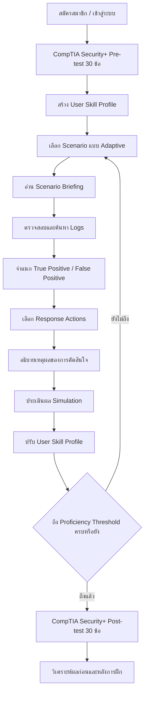
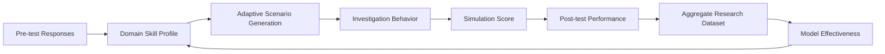
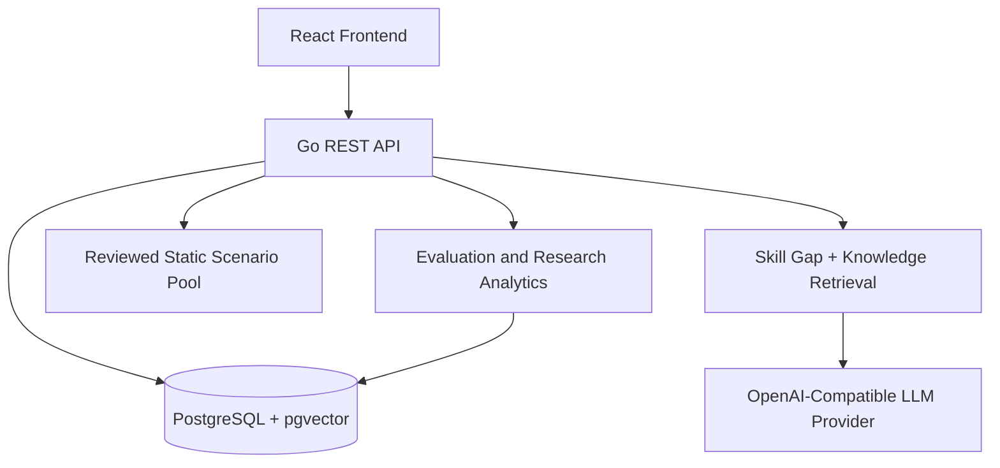

# Automated Data-Driven Cyberattack Simulation for Blue Team Training

## Project Direction

> เอกสารกำหนดทิศทางระดับโครงการสำหรับ Senior Project
>
> สถานะ: **Draft หลัง Grill รอบที่ 4 — Adaptive Loop, Research Protocol และ Deployment Contract ถูกกำหนดเบื้องต้นแล้ว**
>
> ผู้พัฒนาโค้ดหลัก: **Antigravity**
>
> เอกสารนี้ใช้เป็น Source of Truth ด้านแนวคิด ขอบเขต และลำดับการพัฒนา

---

## 1. วิสัยทัศน์ของระบบ

ระบบนี้เป็นแพลตฟอร์ม Web-based สำหรับฝึกผู้เรียนในบทบาท **SOC Tier 1 / Blue Team Analyst** โดยใช้กระบวนการเรียนรู้แบบปรับตามข้อมูลของผู้เรียน:



### หลักการสำคัญ

- ไม่ใช่ระบบโจมตีระบบจริง
- ไม่ใช่ Cyber Range แบบ Attacker → Target ในระยะแรก
- เป็น **Decision-based Blue Team Simulation** ที่ใช้ Scenario และ Logs เป็นข้อมูลให้ผู้เรียนวิเคราะห์
- ออกแบบให้สามารถเพิ่ม Environment-based Simulation ได้ในอนาคต
- Scenario ถูกสร้างแบบ **Real-time ตั้งแต่ต้น** ตามการออกแบบปัจจุบันของโครงการ
- ต้องมี Static Fallback เพื่อให้ระบบยังทำงานได้เมื่อ LLM ไม่พร้อม
- ต้องสามารถประเมินได้ว่าการฝึกส่งผลต่อพัฒนาการของผู้เรียนหรือไม่

---

## 2. เป้าหมายการเรียนรู้

ระบบต้องช่วยให้ผู้เรียนฝึกความสามารถต่อไปนี้:

1. อ่านและตีความ Security Telemetry
2. ค้นหา Key Finding จาก Logs
3. จำแนกเหตุการณ์เป็น True Positive หรือ False Positive
4. เลือก Response Action ที่เหมาะสม
5. อธิบายเหตุผลของการตัดสินใจ
6. เชื่อมโยงเหตุการณ์กับ CompTIA Security+ Domains
7. เชื่อมโยงเหตุการณ์กับ MITRE ATT&CK Techniques
8. พัฒนาจากจุดอ่อนของตนเองผ่าน Scenario แบบ Adaptive

---

## 3. Core User Journey

### Stage 1: Pre-test

- ผู้เรียนทำข้อสอบ CompTIA Security+ จำนวน 30 ข้อ
- คำถามกระจายตาม 5 Security+ Domains ตาม Blueprint ของโครงการ
- ระบบบันทึกคะแนนรวมและคะแนนราย Domain
- ระบบสร้างหรืออัปเดต `User Skill Profile`

### Stage 2: Scenario Assignment

- ระบบพิจารณา Domain ที่ผู้เรียนมี Proficiency ต่ำ
- ระบบสร้าง Scenario แบบ Real-time ด้วย LLM/RAG ตาม Skill Gap
- หาก LLM ใช้งานไม่ได้ ระบบเลือก Scenario จาก Static Scenario Pool
- Scenario ต้องมี Metadata สำหรับการประเมิน เช่น Domain, MITRE Technique, Difficulty และ Expected Outcomes

### Stage 3: Investigation

ผู้เรียนเห็นหน้าต่างหลักของ Scenario ประกอบด้วย:

- Scenario Title
- Scenario Description
- Incident Context
- Initial Logs
- Log Search / KQL-like Query
- Key Findings ที่ผู้เรียนต้องค้นพบ

### Stage 4: Triage and Response

ผู้เรียนต้อง:

1. เลือก True Positive หรือ False Positive
2. เลือก Response Actions จาก Checkbox
3. ในระยะต่อไป เขียนเหตุผลประกอบการตัดสินใจ
4. Response Actions แบ่งตาม:
   - Containment
   - Eradication
   - Recovery

### Stage 5: Evaluation

ระบบประเมินอย่างน้อย:

- TP/FP Classification Accuracy
- Key Finding Discovery
- Response Action Accuracy
- Reasoning Quality เมื่อเปิดใช้คำตอบแบบข้อความ
- Time to Complete
- Scenario Score
- Domain Score

### Stage 6: Post-test and Research Evaluation

- ผู้เรียนจะเข้า Post-test ได้ **เมื่อทุก Domain ถึง Proficiency Threshold เท่านั้น**
- หากไม่ถึง Threshold ภายใน Guardrail ให้จบเป็นสถานะ Incomplete/Not Eligible ตาม Research Protocol และบันทึกเหตุผล
- Post-test ต้องใช้ข้อสอบคนละชุดกับ Pre-test แต่ใช้ Blueprint เดียวกัน
- ระบบเปรียบเทียบ Pre-test, Simulation และ Post-test
- เก็บข้อมูลจากผู้เรียนหลายคนเพื่อวิเคราะห์ว่าการฝึกมีผลต่อพัฒนาการอย่างมีนัยสำคัญหรือไม่
- การไม่ให้ผู้เรียนที่ยังไม่ถึง Threshold เข้า Post-test อาจทำให้เกิด Selection Bias จึงต้องรายงาน Attrition และข้อจำกัดนี้ในงานวิจัย

---

## 4. Data-Driven Definition

คำว่า **Data-Driven** ต้องสะท้อนการทำงานจริงของระบบทั้งวงจร ไม่ใช่เพียงการเก็บ Logs:



### ข้อมูลที่ต้องเก็บ

- Pre-test score รวมและราย Domain
- Post-test score รวมและราย Domain
- Scenario ที่ได้รับ
- Scenario Generation Source
- MITRE Technique และ Security+ Domain
- Logs ที่ผู้เรียนค้นพบ
- Key Findings ที่ค้นพบ
- TP/FP Decision
- Response Actions ที่เลือก
- เหตุผลประกอบการตัดสินใจ ถ้ามี
- คะแนนรายองค์ประกอบ
- เวลาเริ่มและจบ Simulation
- จำนวนครั้งหรือรูปแบบการค้นหา Logs
- ผลการทำ Scenario หลายครั้ง

### ข้อกำหนดด้านข้อมูลวิจัย

- ต้องแยกข้อมูลระบุตัวตนออกจาก Dataset วิเคราะห์เท่าที่ทำได้
- ต้องมี Participant ID หรือ Pseudonymous ID
- ต้องกำหนดว่าข้อมูลใดใช้เพื่อการเรียนรู้ และข้อมูลใดใช้เพื่อการวิจัย
- ต้องแจ้งผู้เข้าร่วมว่าระบบเก็บข้อมูลอะไรและใช้เพื่ออะไร
- ต้องไม่สรุปว่าระบบมีประสิทธิผลจากผู้ใช้เพียงคนเดียว

---

## 5. Mapping สองแกน

Scenario หนึ่งรายการควรผูกกับทั้งสองกรอบ:

| กรอบ | หน้าที่ |
|---|---|
| CompTIA Security+ Domain | วัดความรู้ตามขอบเขตการเรียน/การสอบ |
| MITRE ATT&CK | อธิบายพฤติกรรมและเทคนิคของเหตุการณ์ |

ตัวอย่าง:

```text
Scenario: MFA Push Fatigue
MITRE Technique: T1621 - Multi-Factor Authentication Request Generation
Security+ Domain: Domain 2 - Threats, Vulnerabilities, and Mitigations
Training Skill: Identity Monitoring / Incident Triage
```

ระบบควรรองรับ Scenario หลาย Technique ตั้งแต่ต้น แต่ไม่จำเป็นต้องสร้างครบทุก Technique ใน MVP แรก

---

## 6. ขอบเขตด้านความปลอดภัย

แม้ชื่อโครงการมีคำว่า Cyberattack Simulation แต่ระยะปัจจุบันเป็นการจำลองเหตุการณ์สำหรับการฝึก Blue Team:

- ห้ามโจมตีระบบจริงหรือ Public IP
- Scenario ต้องทำงานกับข้อมูลจำลองหรือระบบที่ได้รับอนุญาตเท่านั้น
- ห้ามให้ผู้เรียนป้อน Target ภายนอกเพื่อสั่งโจมตี
- หากเพิ่ม Environment-based Simulation ต้องแยก Lab Network ชัดเจน
- ต้องมี Scenario Validation และ Kill Switch
- ต้องจำกัดเวลาและขอบเขตของ Scenario
- ต้องเก็บ Audit Log ของการสร้างและการเริ่ม Scenario
- LLM Output ต้องผ่าน Schema Validation ก่อนนำไปแสดง
- Static Fallback ต้องไม่ทำให้ระบบล่มเมื่อ LLM ล้มเหลว

---

## 7. สถาปัตยกรรมเชิงแนวคิด



### สถาปัตยกรรมที่ต้องรักษา

- Frontend ไม่ควรรู้ว่า Scenario มาจาก AI หรือ Static Fallback
- Backend ต้องคืน Scenario Contract รูปแบบเดียวกัน
- Scenario Generator ต้องแยกจาก Scenario Validator
- Scoring ต้องแยกจาก Scenario Generation
- Research Analytics ต้องไม่แก้ไขคะแนนดิบย้อนหลัง
- ทุกคะแนนควรย้อนกลับไปหาเหตุการณ์และคำตอบต้นทางได้

---

## 8. Definition of Done ระดับ Senior Project

- [ ] ผู้เรียนสมัครและเข้าสู่ระบบได้
- [ ] ผู้เรียนทำ Pre-test 30 ข้อได้
- [ ] ระบบคำนวณ Domain Profile ได้
- [ ] ระบบสร้าง Real-time Scenario ได้
- [ ] ระบบมี Static Fallback เมื่อ LLM ใช้งานไม่ได้
- [ ] ผู้เรียนตรวจสอบ Logs และค้นหา Evidence ได้
- [ ] ผู้เรียนเลือก TP/FP ได้
- [ ] ผู้เรียนเลือก Response Actions ได้
- [ ] ระบบคำนวณคะแนน Simulation ได้
- [ ] ระบบเลือก Scenario ต่อไปตาม Skill Gap ได้
- [ ] ผู้เรียนทำ Post-test ได้
- [ ] ระบบแสดง Pre-test เทียบกับ Post-test ได้
- [ ] ระบบเก็บข้อมูลผู้เรียนหลายคนแบบพร้อมวิเคราะห์
- [ ] มีวิธีวิเคราะห์เชิงสถิติที่ระบุไว้ล่วงหน้า
- [ ] มีเอกสารด้านความเป็นส่วนตัวและความปลอดภัย
- [ ] สามารถอธิบายข้อจำกัดของผลการทดลองได้

---

## 9. DevOps Extension

DevOps เป็น Extension ที่ช่วยให้ระบบส่งมอบและดูแลได้ดีขึ้น ไม่ใช่แกนที่ต้องทำให้เสร็จก่อน Core:

1. Git workflow
2. Docker สำหรับ Backend, Frontend และ Database
3. Jenkins สำหรับ Build, Test และ Quality Gate
4. SonarQube สำหรับ Static Code Quality
5. Terraform สำหรับ Environment Definition
6. Ansible สำหรับ Configuration Management
7. Kubernetes สำหรับ Deployment ใน Local Cluster
8. Prometheus สำหรับ Metrics
9. Grafana สำหรับ Dashboard
10. AWS Architecture Mapping โดยไม่สร้าง Resource ที่อาจมีค่าใช้จ่าย

ลำดับที่แนะนำ:

```text
Core Product Stability
→ Docker Reproducibility
→ CI with Jenkins
→ Quality Gate
→ Local Kubernetes
→ Infrastructure / Configuration as Code
→ Observability
→ AWS Migration Design
```

---

## 10. สิ่งที่ยังไม่ควรทำในระยะนี้

- สร้าง Cyber Range เต็มรูปแบบก่อน Core User Journey เสถียร
- สร้าง Attack Payload ที่ใช้กับระบบจริงได้
- เพิ่ม MITRE ATT&CK ครบทุก Technique โดยไม่มีกลยุทธ์ Dataset
- สรุปผลวิจัยจากจำนวนผู้เข้าร่วมน้อยเกินไปโดยไม่ระบุข้อจำกัด
- ใช้คะแนนจาก LLM เป็น Ground Truth โดยไม่มี Rubric หรือ Validation
- เพิ่ม DevOps Tools ทั้งหมดพร้อมกันจนกระทบการทำ Senior Project
- ใช้ AWS จริงโดยไม่มีกระบวนการป้องกันค่าใช้จ่าย

---

## Related Documents

- `docs/GRILL_DECISION_LOG.md`
- `docs/RESEARCH_EVALUATION_PLAN.md`
- `docs/DEVOPS_EXTENSION_ROADMAP.md`
- `docs/ADAPTIVE_LOOP_STATE_MACHINE.md`
- `docs/RESEARCH_PROTOCOL.md`
- `docs/DATABASE_SEEDING_CONTRACT.md`
- `docs/INSTALL_SH_SPECIFICATION.md`
- `docs/SCORING_AND_PROFICIENCY_CONTRACT.md`
- `docs/SCENARIO_GENERATION_AND_FALLBACK_CONTRACT.md`
- `docs/FAILURE_AND_SESSION_STATUS_CONTRACT.md`
- `CONTEXT.md`
- `docs/adr/0001-static-scenario-pool-before-ai.md`
- `docs/adr/0003-llm-rag-scenario-generation.md`

---

## Conflict Note

เอกสาร ADR-0001 อธิบายแนวทาง Static Scenario ก่อน AI ในช่วง Build Phase ขณะที่ ADR-0003 ระบุการใช้งาน Real-time LLM Scenario Generation พร้อม Static Fallback ในระบบปัจจุบัน เอกสารนี้ยืนยันสถานะปัจจุบันตาม ADR-0003 และควรพิจารณาปรับสถานะ/ขอบเขตของ ADR-0001 ให้สอดคล้องกันในรอบถัดไป โดยไม่ลบประวัติการตัดสินใจเดิม

---

**เอกสารนี้เป็นทิศทางระดับโครงการ ไม่ใช่คำสั่งให้แก้โค้ดโดยอัตโนมัติ**

**เจ้าของการตัดสินใจและการพัฒนาโค้ด: ผู้จัดทำ Senior Project และ Antigravity**

