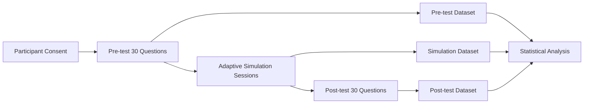

# Research Evaluation Plan

## Purpose

กำหนดกรอบเบื้องต้นเพื่อประเมินว่า Simulation มีผลต่อพัฒนาการของผู้เรียนหรือไม่ โดยใช้ข้อมูลจากผู้เรียนหลายคน ไม่สรุปผลจากการทดลองรายบุคคลเพียงคนเดียว

สถานะ: **Draft — ต้องผ่านการทบทวนกับอาจารย์และคณะกรรมการจริยธรรม/การเก็บข้อมูลตามข้อกำหนดของสถาบัน**

---

## 1. Research Question

> ผู้เรียนที่ผ่านกระบวนการ Pre-test → Adaptive Scenario Simulation → Post-test มีผลคะแนนหลังการฝึกสูงกว่าก่อนการฝึกหรือไม่ และการเปลี่ยนแปลงนั้นมีนัยสำคัญทางสถิติหรือไม่?

### คำถามรอง

1. Domain ใดมีการพัฒนามากที่สุด?
2. จำนวน Scenario ที่ทำสัมพันธ์กับการพัฒนาหรือไม่?
3. Scenario ที่เลือกจาก Skill Gap ช่วยลดจุดอ่อนของผู้เรียนได้หรือไม่?
4. Detection/Investigation/Response ส่วนใดเปลี่ยนแปลงมากที่สุด?
5. ผู้เรียนทำ Scenario ได้ดีขึ้นจากครั้งแรกถึงครั้งถัดไปหรือไม่?

---

## 2. ตัวแปรหลัก

### Primary Outcome

- คะแนน Post-test เทียบกับคะแนน Pre-test
- คะแนนรวมและคะแนนราย CompTIA Security+ Domain

### Secondary Outcomes

- Simulation Score
- True Positive / False Positive Accuracy
- Key Finding Discovery Score
- Response Action Score
- Time to Complete
- จำนวน Scenario ที่ทำ
- Domain Proficiency ก่อนและหลังแต่ละ Scenario

### Potential Covariates

- ประสบการณ์ด้าน Cybersecurity ก่อนเริ่มระบบ
- คะแนน Pre-test เดิม
- เวลาที่ใช้ในระบบ
- จำนวนครั้งที่กลับมาฝึก
- ความยากของ Scenario

---

## 3. Measurement Design

### เงื่อนไขขั้นต่ำของการเปรียบเทียบ

- Pre-test และ Post-test ต้องมี Blueprint เทียบเคียงกัน
- ไม่ควรใช้ข้อสอบชุดเดียวกันตรง ๆ
- ต้องเก็บคะแนนราย Domain
- ต้องระบุจำนวนผู้เข้าร่วมที่เริ่มและจบกระบวนการ
- ต้องบันทึก Missing Data และ Abandonment
- ต้องประกาศเกณฑ์ตัดข้อมูลก่อนวิเคราะห์ ไม่ตัดผู้เรียนย้อนหลังเพียงเพราะผลไม่สวย

---

## 4. Statistical Analysis Candidate

การเลือกสถิติสุดท้ายต้องยืนยันกับอาจารย์/ผู้เชี่ยวชาญด้านวิจัย แต่กรอบเบื้องต้นคือ:

### กรณี Pre/Post เป็นผู้เรียนคนเดียวกัน

- ตรวจการกระจายของค่าความแตกต่าง
- ใช้ **Paired t-test** หากเงื่อนไขของข้อมูลเหมาะสม
- ใช้ **Wilcoxon signed-rank test** หากข้อมูลไม่เป็นไปตามสมมติฐานของ Paired t-test หรือเป็นคะแนนที่เหมาะกับ non-parametric analysis
- รายงาน Effect Size และ Confidence Interval ไม่รายงานเฉพาะ p-value

### กรณีวิเคราะห์หลาย Domain หรือหลายช่วงเวลา

- พิจารณา Repeated Measures Model หรือ Mixed-Effects Model
- ควบคุมปัญหาการทดสอบหลายครั้ง เช่น Multiple Comparison Correction
- แยก Primary Outcome ออกจาก Exploratory Outcomes

### สิ่งที่ต้องรายงาน

- จำนวนตัวอย่าง (n)
- ค่าเฉลี่ย/มัธยฐานและการกระจาย
- Mean/Median Difference
- Confidence Interval
- p-value
- Effect Size
- Missing Data
- Inclusion/Exclusion Criteria
- ข้อจำกัดด้าน Sample Size และ Generalizability

> ห้ามกำหนดว่าผล “มีนัยสำคัญ” จากค่า p เพียงอย่างเดียว และห้ามอ้างเหตุและผลเกินกว่ารูปแบบการทดลองที่ทำจริง

---

## 5. Dataset Requirements

### Participant-level Data

- `participant_id` แบบไม่เปิดเผยตัวตน
- `consent_status`
- `started_at`, `completed_at`
- `pre_test_session_id`
- `post_test_session_id`
- ประสบการณ์เบื้องต้นที่จำเป็นต่อการวิเคราะห์

### Assessment-level Data

- `assessment_type`: pre/post
- `question_id`
- `domain_id`
- `user_answer`
- `is_correct`
- `score`
- `time_spent_seconds`

### Simulation-level Data

- `simulation_session_id`
- `scenario_id`
- `generation_type`
- `fallback_reason` ถ้ามี
- `domain_id`
- `mitre_technique`
- `difficulty`
- `selected_actions`
- `discovered_findings`
- `tp_fp_selected`
- `final_score`
- เวลาที่ใช้

### Audit and Quality Data

- Scenario Generation Request ID
- Scenario Validation Result
- Model/Prompt Version หากใช้ LLM
- Rubric Version
- Data Export Version

---

## 6. Validity Risks

| ความเสี่ยง | ผลกระทบ | แนวทางลดความเสี่ยง |
|---|---|---|
| Pre/Post ข้อสอบไม่เทียบเท่ากัน | คะแนนเปรียบเทียบไม่ได้ | ใช้ Blueprint และ Difficulty ที่ใกล้เคียงกัน |
| ผู้เรียนจำคำตอบได้ | Post-test สูงเกินจริง | ใช้ Item Pool คนละชุด |
| Scenario ยากไม่เท่ากัน | Simulation Score เปรียบเทียบยาก | เก็บ Difficulty และทำ Calibration |
| LLM สร้าง Scenario ไม่คงที่ | ผลทดลองทำซ้ำยาก | เก็บ Prompt/Model/Seed/Output และใช้ Schema Validation |
| ผู้เรียนออกจากระบบกลางคัน | Missing Data | บันทึก Abandonment และกำหนดเกณฑ์ล่วงหน้า |
| จำนวนตัวอย่างน้อย | Power ต่ำ | รายงานเป็น Pilot Study และไม่อ้างผลทั่วไปเกินจริง |
| Familiarity กับ Security+ ต่างกัน | Confounding | เก็บข้อมูลพื้นฐานและพิจารณาเป็น Covariate |
| LLM ให้คะแนนเหตุผลไม่สม่ำเสมอ | Reliability ต่ำ | ใช้ Rubric ตรวจสอบและเก็บคะแนนดิบ/เหตุผล |

---

## 7. Privacy and Ethics Checklist

- [ ] มี Participant Information Sheet
- [ ] มี Consent ก่อนเก็บข้อมูลเพื่อวิจัย
- [ ] ใช้ Participant ID แทนชื่อจริงใน Dataset วิเคราะห์
- [ ] แยกข้อมูล Login/Auth ออกจากข้อมูลวิจัย
- [ ] กำหนดระยะเวลาเก็บรักษาข้อมูล
- [ ] กำหนดสิทธิ์การเข้าถึงข้อมูล
- [ ] กำหนดวิธีลบข้อมูลเมื่อผู้เข้าร่วมร้องขอ ตามข้อกำหนดที่เกี่ยวข้อง
- [ ] ห้ามส่งข้อมูลส่วนบุคคลเข้า LLM โดยไม่จำเป็น
- [ ] ตรวจสอบข้อกำหนดของมหาวิทยาลัยก่อนเริ่มเก็บข้อมูลจริง

---

## 8. Result Interpretation

ผลลัพธ์ควรตอบอย่างระมัดระวัง:

- หากคะแนน Post-test สูงขึ้นอย่างมีนัยสำคัญ อาจกล่าวได้ว่าพบหลักฐานสนับสนุนว่าผู้เรียนมีพัฒนาการหลังใช้ระบบภายใต้เงื่อนไขของการทดลอง
- ไม่ควรกล่าวทันทีว่าระบบเป็นสาเหตุเดียว หากไม่มี Control Group หรือ Randomized Design
- ควรรายงานทั้ง Statistical Significance และ Practical Significance
- ต้องรายงานผลที่ไม่เป็นไปตามสมมติฐานด้วย

---

## 9. Open Research Decisions

คำถามที่ต้องคุยกับอาจารย์/ผู้ดูแลงานวิจัย:

1. จะใช้ One-group Pretest-Posttest หรือมีกลุ่มควบคุม?
2. จำนวนผู้เข้าร่วมเป้าหมายเท่าไร?
3. จะใช้เกณฑ์นัยสำคัญ เช่น `alpha = 0.05` หรือไม่?
4. จะกำหนด Primary Outcome เพียงตัวเดียวหรือไม่?
5. จะให้ผู้เรียนทำ Simulation กี่ Scenario ก่อน Post-test?
6. จะวัด Retention หลังเวลาผ่านไปหรือไม่?
7. ต้องขออนุมัติจริยธรรมการวิจัยรูปแบบใด?

---

**เอกสารนี้เป็นกรอบการออกแบบการประเมิน ไม่ใช่ผลการทดลอง และไม่ควรใช้เป็นข้อสรุปก่อนมีข้อมูลจริง**

