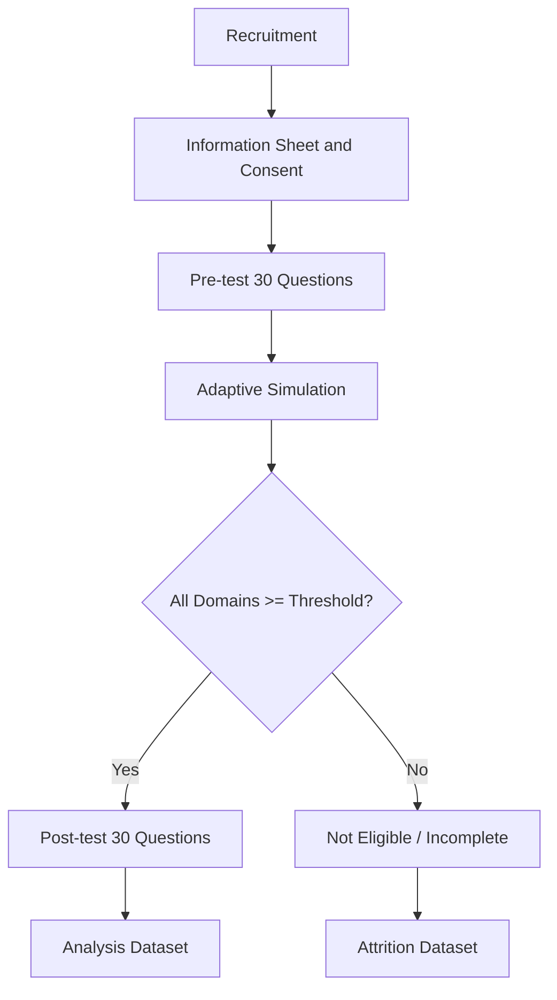

# Research Protocol

## Purpose

กำหนดรูปแบบการทดลองเพื่อประเมินผลของ Adaptive Blue Team Simulation ต่อพัฒนาการของผู้เรียนหลายคน

สถานะ: **Draft — ต้องทบทวนกับอาจารย์และข้อกำหนดจริยธรรมของสถาบันก่อนเก็บข้อมูลจริง**

---

## 1. Research Design

### Primary Design

**One-group Pretest–Posttest**

```text
Consent
→ Pre-test 30 ข้อ
→ Adaptive Simulation Loop
→ Post-test 30 ข้อ เฉพาะผู้ที่ถึง Threshold ครบทุก Domain
```

### Optional Comparison Group

หากมีผู้เข้าร่วมเพียงพอ สามารถเพิ่ม Comparison Group ได้ โดยต้องกำหนดวิธีคัดเลือกและการควบคุมความแตกต่างระหว่างกลุ่มก่อนเริ่มการทดลอง

ระบบต้องไม่ผูกติดกับการมีกลุ่มควบคุม เพราะ Pilot แรกอาจใช้ One-group Design

---

## 2. Research Question

> ผู้เรียนที่ผ่าน Pre-test → Adaptive Scenario Simulation → Post-test มีคะแนนหลังการฝึกสูงกว่าก่อนการฝึกหรือไม่ และความแตกต่างนั้นมีนัยสำคัญทางสถิติหรือไม่?

### Primary Outcome

```text
post_test_total_score - pre_test_total_score
```

### Secondary Outcomes

- คะแนนแยกตาม CompTIA Security+ Domain
- Simulation Score
- Key Finding Discovery Score
- TP/FP Accuracy
- Response Action Accuracy
- จำนวน Scenario ที่ทำ
- Time to Complete
- อัตราการถึง Threshold
- อัตราการ Abandonment/Not Eligible

---

## 3. Participant Flow



### Important Consequence of Q21

ผู้ที่ไม่ถึง Threshold จะไม่เข้า Post-test ตาม Protocol นี้ ทำให้ Primary Pre/Post Analysis เป็นการวิเคราะห์เฉพาะผู้ที่ผ่าน Eligibility Gate ดังนั้นต้องรายงาน:

- จำนวนผู้สมัคร
- จำนวนผู้ยินยอม
- จำนวนผู้เริ่ม Pre-test
- จำนวนผู้เข้า Simulation
- จำนวนผู้ถึง Threshold
- จำนวนผู้ได้สิทธิ์ Post-test
- จำนวนผู้ทำ Post-test เสร็จ
- จำนวนผู้ไม่ผ่าน/ถอนตัว

ห้ามเรียกผลจากกลุ่มที่ผ่าน Threshold ว่าเป็นผลของผู้เรียนทั้งหมดโดยไม่ระบุ Selection Bias

---

## 4. Standardized Parameters

ค่าตั้งต้นที่ใช้ใน Protocol:

```text
pre_test_questions = 30
post_test_questions = 30
proficiency_threshold = 70%
max_scenarios = 10
simulation_time_limit = 120 minutes
llm_max_retries = 2
```

หากเปลี่ยนค่าต้องสร้าง Protocol Version ใหม่ และบันทึกค่าที่ใช้กับ Participant ทุกคน

---

## 5. Scenario Standardization

ทุก Real-time Scenario ต้องมี Blueprint ก่อน Generate:

- CompTIA Security+ Domain
- MITRE ATT&CK Technique
- Difficulty
- Required Key Findings
- Correct TP/FP
- Correct Response Actions
- Scoring Rubric
- Prompt Version
- Model/Provider Metadata

หลัง Generate ต้องเก็บ Snapshot ที่ผู้เรียนเห็นจริง เพื่อให้ผลการทดลองตรวจสอบย้อนหลังได้

---

## 6. Data Analysis Plan

### Primary Analysis

- คำนวณ Difference Score รายคน
- ตรวจ Distribution ของ Difference Score
- ใช้ Paired t-test เมื่อสมมติฐานเหมาะสม
- ใช้ Wilcoxon signed-rank test เมื่อไม่เหมาะสม
- รายงาน Effect Size, Confidence Interval และ p-value

### Secondary Analysis

- Domain-level Improvement
- Simulation Exposure เป็นตัวแปรร่วม
- Prior Experience เป็นตัวแปรร่วม
- วิเคราะห์ Not Eligible และ Abandonment แยกต่างหาก

### Interpretation

- Statistical Significance ไม่เท่ากับ Practical Significance
- หากไม่มี Control Group ห้ามอ้างเหตุและผลเกินรูปแบบการทดลอง
- ต้องรายงานผลที่ไม่สนับสนุนสมมติฐาน
- ต้องรายงาน Missing Data และ Selection Bias

---

## 7. Data Integrity

- Raw Responses ห้ามแก้ไขย้อนหลัง
- Scoring Rubric ต้องมี Version
- Scenario Snapshot ต้องผูกกับ Simulation Session
- Export Dataset ต้องมี Export Version
- ห้ามส่ง PII เข้า LLM โดยไม่จำเป็น
- แยก Authentication Data จาก Research Dataset
- ใช้ Pseudonymous Participant ID

---

## 8. Required Reports

- Participant Flow Report
- Pre/Post Descriptive Statistics
- Domain Breakdown
- Simulation Exposure Summary
- Eligibility and Attrition Report
- Statistical Test Report
- Effect Size and Confidence Interval
- Limitations
- Reproducibility Metadata

---

## 9. Ethics Gate

ก่อนเก็บข้อมูลจริงต้องยืนยัน:

- Consent Process
- Data Retention
- Access Control
- Withdrawal Process
- Privacy Notice
- Institutional Approval ที่จำเป็น
- การจัดการผู้เรียนที่ไม่ผ่าน Threshold โดยไม่ตีตรา

---

**เอกสารนี้เป็น Protocol สำหรับการออกแบบการทดลอง ไม่ใช่ผลการทดลอง**
