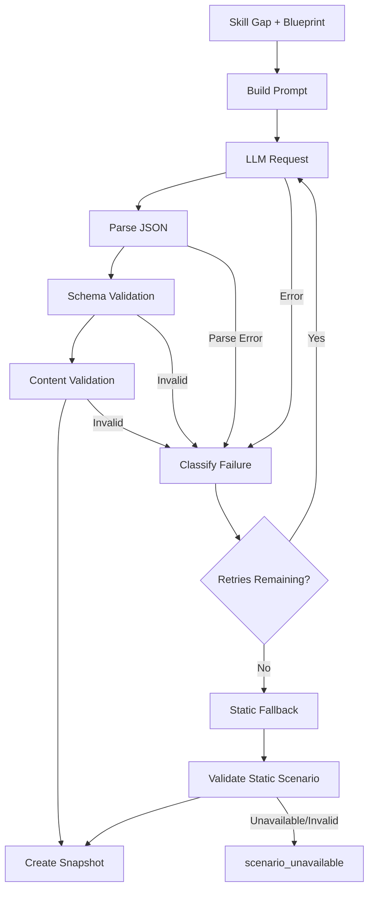

# Scenario Generation and Fallback Contract

## Purpose

กำหนดขั้นตอน Real-time Scenario Generation, Validation, Retry และ Static Fallback ให้ปลอดภัย ทำซ้ำได้ และตรวจสอบย้อนหลังได้

สถานะ: **Draft — Contract สำหรับ Antigravity**

---

## 1. Generation Pipeline



---

## 2. Default Configuration

```text
llm_max_retries = 2
llm_timeout_seconds = configurable
fallback_enabled = true
```

ทุกค่าต้องบันทึกใน Generation Metadata เมื่อสร้าง Scenario

---

## 3. Blueprint Contract

ก่อนเรียก LLM ต้องสร้าง Blueprint ที่ระบุ:

- `security_domain`
- `mitre_technique`
- `difficulty`
- `scenario_type`
- `required_log_sources`
- `required_key_findings`
- `expected_tp_fp`
- `required_response_actions`
- `scoring_rubric_version`
- `prompt_version`

LLM มีหน้าที่เติมเนื้อหาตาม Blueprint ไม่ใช่กำหนด Ground Truth เองโดยไม่มีการตรวจสอบ

---

## 4. Validation Layers

### Schema Validation

ตรวจ Required Fields, Types, Array Shapes, ID Format และ JSON Parse

### Referential Validation

ตรวจว่า:

- Domain มีอยู่จริง
- MITRE Technique อยู่ใน Reference Data หรือถูกระบุเป็น Unmapped อย่างชัดเจน
- Finding อ้างถึง Log ที่มีอยู่
- Action ID ไม่ซ้ำ
- Points เป็นตัวเลขในช่วงที่กำหนด

### Content Validation

ตรวจว่า:

- Scenario สอดคล้องกับ Blueprint
- TP/FP มี Ground Truth
- มี Noise และ Evidence ตามจำนวนขั้นต่ำ
- ไม่มี Payload หรือคำสั่งโจมตีระบบจริงที่ไม่จำเป็น
- ไม่มี Secret หรือ PII ที่ไม่จำเป็น
- Response Actions มีเหตุผลด้าน Blue Team

Scenario ที่ไม่ผ่าน Content Validation ห้ามส่งต่อ Frontend

---

## 5. Failure Reason Codes

```text
missing_api_key
provider_unavailable
timeout
rate_limit
http_error
invalid_json
schema_validation_failed
referential_validation_failed
content_validation_failed
static_pool_empty
static_scenario_invalid
```

ต้องเก็บ `failure_reason` และ `failure_stage` โดยไม่เก็บ API Key

---

## 6. Retry Policy

Retry เฉพาะ Error ที่มีโอกาสหายได้ เช่น:

- Timeout
- Provider Unavailable
- Rate Limit
- Transient HTTP Error

ไม่ควร Retry แบบไร้ประโยชน์สำหรับ:

- Missing API Key
- Invalid Configuration
- Persistent Schema Error จาก Prompt/Parser เดิม

อย่างไรก็ตาม หาก Retry Schema/Content Failure ให้เปลี่ยน Request Context หรือ Prompt Version ตามนโยบาย ไม่ใช่ส่งข้อความเดิมซ้ำไม่จำกัด

เมื่อครบ 2 ครั้ง ให้ Fallback และเก็บ Retry Count

---

## 7. Static Fallback

Static Fallback ต้อง:

- เลือกจาก Domain/Technique ที่ตรงหรือใกล้เคียงตาม Policy
- ผ่าน Validation เดียวกับ LLM Scenario
- สร้าง Snapshot เช่นเดียวกัน
- ตั้ง `generation_type = static_fallback`
- เก็บ `fallback_reason`
- ไม่เปลี่ยน Ground Truth หลังผู้เรียนเริ่ม Session

ห้ามใช้ Static Fallback แบบสุ่มข้าม Domain โดยไม่มี Selection Reason

---

## 8. Scenario Snapshot Metadata

ทุก Scenario ที่แสดงให้ผู้เรียนต้องมี:

```text
scenario_snapshot_id
simulation_session_id
source_type
provider
model
prompt_version
blueprint_version
rubric_version
validation_status
fallback_reason
selection_reason
created_at
rendered_at
```

API Key และ Secret ทุกชนิดต้องไม่อยู่ใน Snapshot

---

## 9. Unavailable Handling

หาก LLM Retry ครบและ Static Pool ไม่มี Scenario ที่ Valid:

```text
state = scenario_unavailable
```

ต้อง:

- ไม่ลงโทษผู้เรียน
- ไม่เพิ่ม Scenario Count แบบ Completed
- ไม่อัปเดต Proficiency Score
- บันทึก System Failure Record
- แสดงข้อความที่ไม่กล่าวโทษผู้เรียน
- ให้ Resume/Retry ตามนโยบาย

---

## 10. Reproducibility

เก็บอย่างน้อย:

- Prompt Version
- Blueprint Version
- Model
- Provider
- Generation Timestamp
- Validation Result
- Scenario Snapshot
- Rubric Version
- Fallback Reason

Raw LLM Prompt/Response สามารถเก็บแบบ Restricted ได้ตาม Privacy Policy แต่ต้องไม่เก็บ Secret และต้องกำหนด Retention

---

## 11. Generation Test Cases

- Valid LLM Output → AI Snapshot
- Timeout ครั้งแรก → Retry
- Retry ครบ → Static Fallback
- Missing API Key → ไม่ Retry แบบไร้ประโยชน์, Fallback
- Invalid JSON → Retry ตาม Policy
- Valid JSON แต่ Finding อ้าง Log Index ไม่มี → Validation Fail
- Static Pool ไม่มี Candidate → `scenario_unavailable`
- Fallback Scenario → ไม่ถูกนับเป็น LLM Generated
- Same Snapshot Refresh → ผู้เรียนเห็น Scenario เดิม
- API Key ไม่ปรากฏใน Logs/Response/Snapshot

---

## 12. Acceptance Criteria

- [ ] LLM Output ผ่าน Schema และ Content Validation
- [ ] Retry มีเพดาน 2 ครั้งเป็น Default
- [ ] ทุก Failure มี Reason Code
- [ ] Static Fallback ใช้ Contract เดียวกัน
- [ ] Scenario Snapshot เกิดก่อน User Response
- [ ] Scenario Unavailable ไม่กระทบคะแนนผู้เรียน
- [ ] Provider/Model/Prompt Version ตรวจสอบย้อนหลังได้
- [ ] ไม่มี Secret ใน Log หรือ Snapshot

---

## Open Decisions

- ใช้ JSON Schema Library ใดใน Go
- Content Validation ระดับใดจะทำแบบ Deterministic
- Static Fallback เลือก Technique ใกล้เคียงอย่างไร
- Restricted Raw Payload จะเก็บนานเท่าไร

